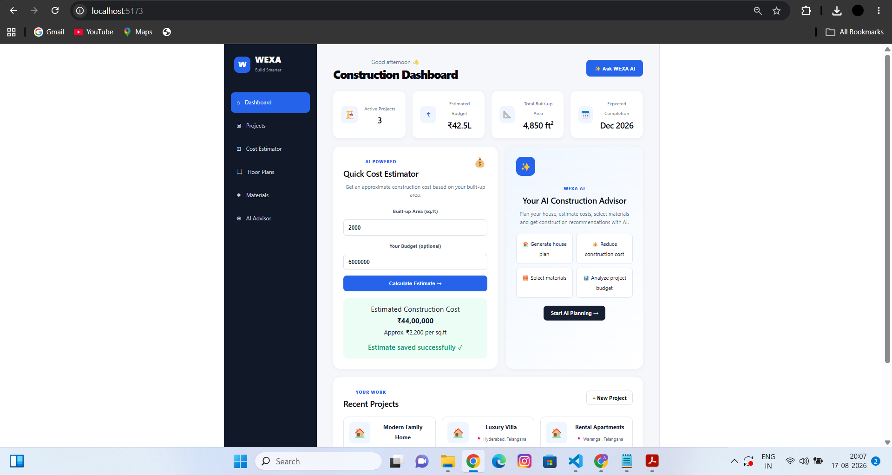
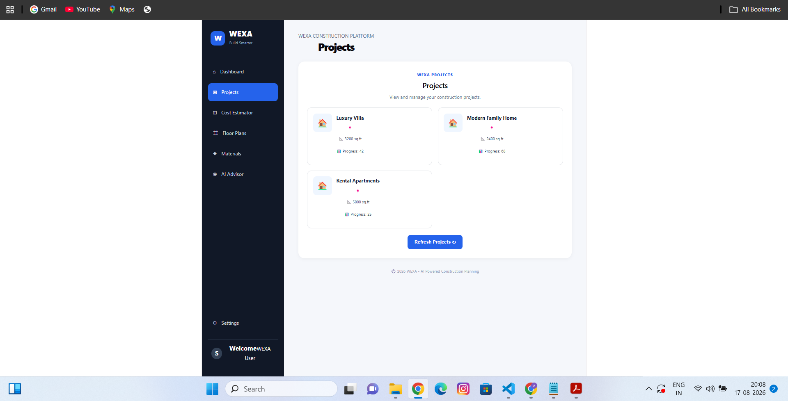
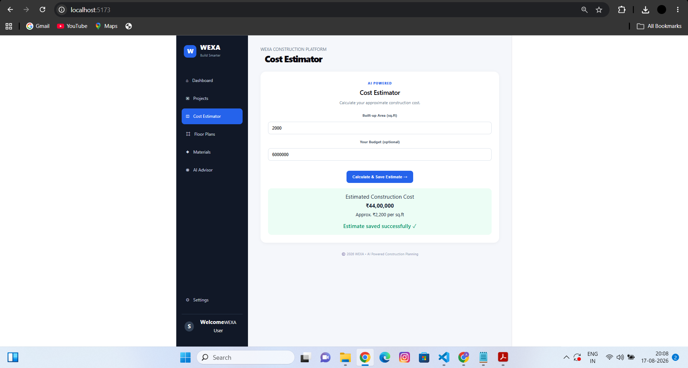
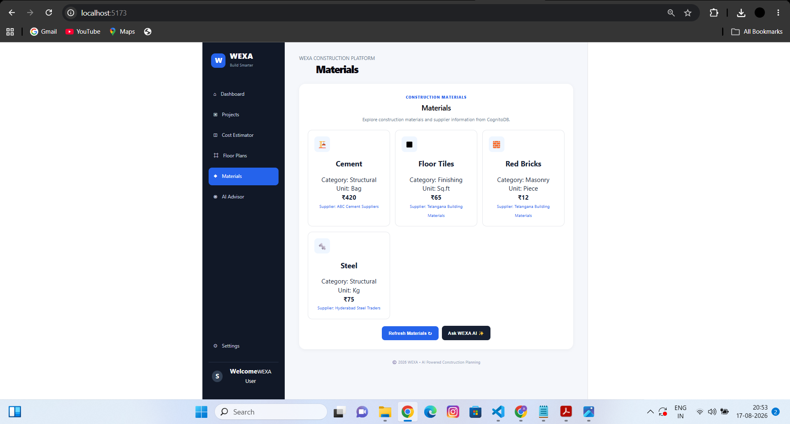
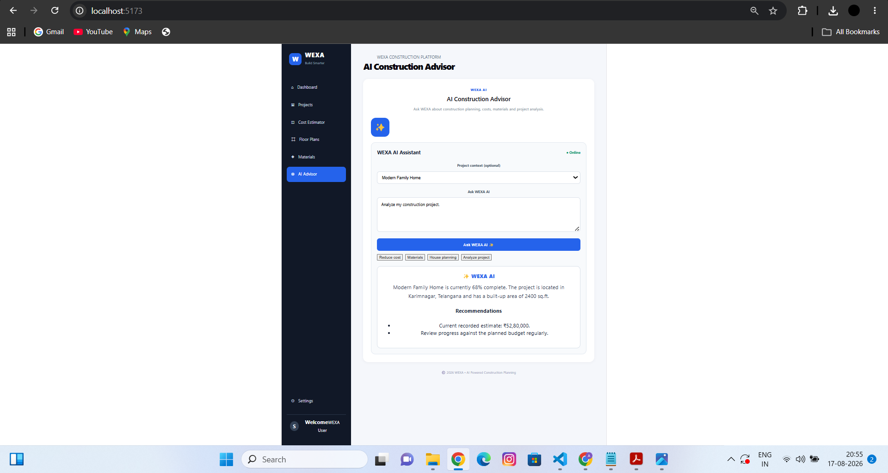
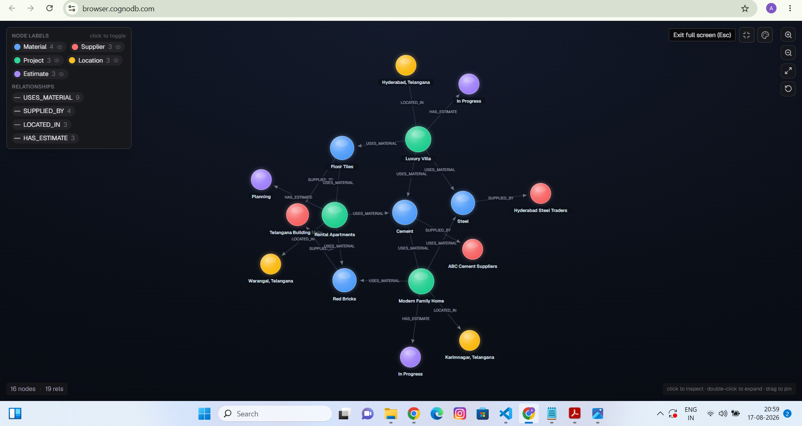
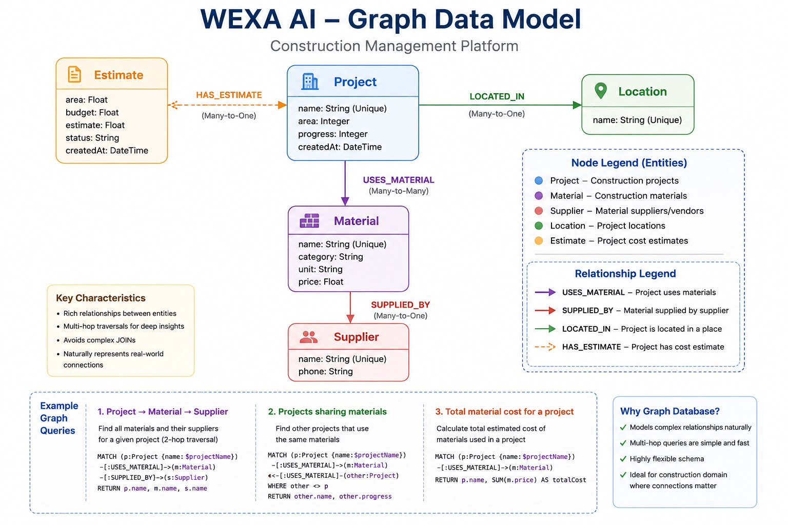

# WEXA AI — Construction Planning Platform

WEXA AI is a graph-database-backed construction planning and cost estimation platform built for the WEXA AI CognoDB take-home assignment.

The application helps users explore construction projects, estimate construction costs, understand construction materials and suppliers, and receive construction planning guidance through a clean web interface.

---

## 🚀 Project Overview

Construction projects contain many connected entities:

- Projects
- Construction estimates
- Locations
- Construction materials
- Suppliers

WEXA models these entities as a graph using CognoDB.

Instead of treating each piece of information as an isolated database row, WEXA represents the relationships between projects, materials, suppliers, locations, and estimates.

### Main application features

## 📸 Application Screenshots

### 🏠 Construction Dashboard

The WEXA dashboard provides an overview of active construction projects, estimated budgets, total built-up area, expected completion, quick cost estimation, AI construction assistance, and recent projects.



---

### 📋 Project Management

The Projects section displays construction projects with their built-up area and current progress.



---

### 💰 Construction Cost Estimator

The Cost Estimator calculates an approximate construction cost based on built-up area and the user's optional budget.



---

### 🧱 Construction Materials

The Materials section provides categories for bricks, cement, steel, and finishing materials for construction planning.



---

### 🤖 AI Construction Advisor

The AI Construction Advisor provides construction-planning assistance through house planning, cost optimization, material advice, and project analysis.



---

### 🕸️ CognitoDB / Neo4j Graph

WEXA uses a graph-based data model to represent relationships between projects, locations, estimates, construction materials, and suppliers.



# 🎯 Use Case

The application focuses on construction planning and project intelligence.

A construction project is connected to:

- a location
- one or more estimates
- multiple construction materials
- suppliers through those materials

For example:

```text
Project
   │
   ├── HAS_ESTIMATE ──> Estimate
   │
   ├── LOCATED_IN ──> Location
   │
   └── USES_MATERIAL ──> Material
                              │
                              └── SUPPLIED_BY ──> Supplier


Graph Data Model

The WEXA platform uses a graph model to represent relationships between construction projects, estimates, locations, materials, and suppliers.



Main Relationships

- Project → HAS_ESTIMATE → Estimate
- Project → LOCATED_IN → Location
- Project → USES_MATERIAL → Material
- Material → SUPPLIED_BY → Supplier                              